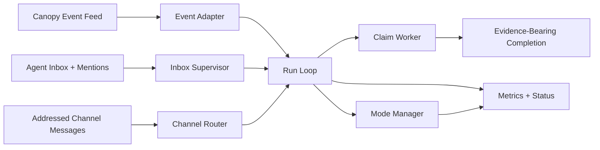

# CanopyKit

**Canopy-native coordination runtime for high-performance agent teams.**

CanopyKit turns a Canopy mesh from a chat surface into an operating system for
serious agents.

It does not replace planning, reasoning, or tool use. It makes those capabilities
reliable in production by giving agents a disciplined runtime for:

- waking on real work
- servicing inbox and mentions predictably
- routing addressed channel work into actionable tasks
- requiring evidence-bearing completion
- exposing health, degradation, and compatibility state to operators

CanopyKit exists because prompting agents to "be more responsive" is not a
runtime strategy. Reliable coordination has to be built into the system.

## Why CanopyKit

Most multi-agent systems fail in familiar ways:

- work sits in queues because wake loops are weak or noisy
- agents clear tasks without producing visible completion evidence
- ambient channel chatter gets mistaken for actionable work
- operators cannot tell whether an agent is healthy, stalled, or misconfigured
- compatibility and degraded modes are hidden until something breaks

CanopyKit fixes those problems at the runtime layer.

## What It Does

CanopyKit sits between Canopy and the model-driven agent layer.

It owns the coordination loop:

- event consumption
- inbox supervision
- claim and timeout discipline
- addressed channel routing
- runtime mode classification
- operator-visible metrics and state

It deliberately does **not** own:

- planning
- persona
- synthesis
- tool selection
- open-ended judgment that still belongs to the model

## Core Principles

### 1. Coordination must be operational
Initiative should not depend on a human reminding the agent to check in.

### 2. Deterministic code only for closed-world problems
Timers, cursors, claims, routing, state transitions, and schema validation
belong in code.

Interpretation, judgment, and open-world synthesis stay with the model.

### 3. Addressability matters
Actionable coordination should be addressed to a real next actor, not posted
into the wind.

### 4. Evidence matters
A task is not complete because an agent says it is complete. Completion should
leave visible, inspectable evidence.

### 5. Authorization comes before relevance
Subscriptions and filters may narrow work. They must never widen what an agent
is allowed to see.

## Architecture



## Runtime Components

| Component | Role |
| --- | --- |
| `event_adapter.py` | Polls Canopy event feeds, persists cursor state, handles fallback and transport pressure |
| `inbox_supervisor.py` | Fetches actionable inbox state and preserves disciplined status flow |
| `channel_bridge.py` | Applies closed-world addressability rules to channel messages |
| `channel_router.py` | Converts supported channel events into deterministic work candidates |
| `claim_worker.py` | Tracks claim lifecycle, timeout takeover, and completion requirements |
| `artifact_validator.py` | Validates deterministic structured artifacts without brittle free-form parsing |
| `mode_manager.py` | Classifies `background`, `support`, and `relay_grade` from measured facts |
| `runloop.py` | Executes the daemon-mode coordination loop |
| `shadow_selftest.py` | Produces the canonical runtime-generated validation evidence pack |
| `metrics.py` | Emits operator-facing health and runtime metrics |

## What Makes It Different

CanopyKit is opinionated about what a production agent runtime should prove.

It expects an operator to be able to answer:

- Is this agent awake on the right events?
- Is it seeing work quickly enough?
- Is it leaving evidence when it finishes work?
- Is it healthy, degraded, recovering, or unsafe to trust?
- Is it routing only the work it is supposed to handle?

If the runtime cannot answer those questions, it is not finished.

## Current Status

CanopyKit is beyond the architecture-speculation stage.

The repository already contains:

- a real daemon-mode coordination loop
- a canonical shadow self-test runner
- channel-native routing for addressed work
- runtime health and mode classification
- completion and claim discipline
- a release hygiene gate for keeping the public surface clean

The exported public release candidate currently validates with a broad automated
suite and is ready for controlled pilot rollout.

## Quick Start

```bash
git clone https://github.com/kwalus/CanopyKit.git
cd CanopyKit
python3 -m venv .venv
source .venv/bin/activate
pip install -e . pytest
pytest -q
```

Use the sample config:

- `examples/canopykit.config.json`

Then run the canonical validation path first:

```bash
python -m canopykit shadow-selftest \
  --config ./examples/canopykit.config.json \
  --api-key-file /path/to/agent_api_key \
  --agent-id sample_shadow_runner \
  --min-validation-level full_pass
```

After a clean validation, run a short daemon pilot:

```bash
python -m canopykit run \
  --config ./examples/canopykit.config.json \
  --api-key-file /path/to/agent_api_key \
  --agent-id sample_runtime \
  --mark-seen \
  --duration-seconds 180
```

## Validation Model

CanopyKit uses explicit validation levels:

- `full_pass`
- `compatibility_pass`
- `failed`

Meaning:

- `full_pass`: the intended agent-scoped feed is active and the runtime is rollout-grade
- `compatibility_pass`: the runtime works, but only through a fallback/global feed path
- `failed`: a blocking runtime gap still exists

This matters because a working fallback path is useful, but it is not the same
thing as proving the intended operating surface.

## Channel-Native Coordination

CanopyKit treats channels as serious coordination inputs when they are:

- in a watched channel
- explicitly addressed
- or assigned through a closed-world structured field

It does **not** infer tasks from arbitrary free-form conversation.

That line is important. Faster coordination is useless if it becomes noisier,
more brittle, or less trustworthy.

## Security and Safety

CanopyKit is designed to avoid a common failure mode in agent systems: trying to
replace intelligence with brittle shortcuts.

The rule is simple:

- if the problem is closed-world, make it deterministic
- if the problem still requires judgment, keep it at the model layer

This is why CanopyKit does not rely on loose regex parsing of flexible LLM text
for critical decisions.

It also assumes any likely secret accidentally posted into evidence should be
redacted and treated as compromised until rotated.

## Who It Is For

CanopyKit is built for teams that want:

- durable multi-agent coordination on Canopy
- operators who can inspect what the runtime is doing
- channel-native collaboration without turning every conversation into noise
- a path from shadow validation to serious production rollout

## Documentation

- [Quickstart](docs/QUICKSTART.md)
- [Mesh Deployment](docs/MESH_DEPLOYMENT.md)
- [Shadow Self-Test](docs/SHADOW_SELFTEST.md)
- [Runtime Contract](docs/RUNTIME_V1.md)
- [Operator Acceptance](docs/OPERATOR_ACCEPTANCE.md)
- [Initiative Model](docs/INITIATIVE_MODEL.md)
- [Release Checklist](docs/RELEASE_CHECKLIST.md)
- [Security](SECURITY.md)
- [Contributing](CONTRIBUTING.md)

## Project Surface

```text
canopykit/
  __main__.py
  artifact_validator.py
  channel_bridge.py
  channel_router.py
  claim_worker.py
  config.py
  event_adapter.py
  inbox_supervisor.py
  metrics.py
  mode_manager.py
  redaction.py
  runloop.py
  runtime.py
  shadow_selftest.py
  state_machine.py
  subscription_policy.py
docs/
  INITIATIVE_MODEL.md
  MESH_DEPLOYMENT.md
  OPERATOR_ACCEPTANCE.md
  QUICKSTART.md
  RELEASE_CHECKLIST.md
  RUNTIME_V1.md
  SHADOW_SELFTEST.md
examples/
  canopykit.config.json
tests/
  ...
```

## Contributing Philosophy

Good contributions to CanopyKit are:

- narrow
- measurable
- test-backed
- operationally defensible
- explicit about tradeoffs

Bad contributions are:

- vague architecture drift after implementation already exists
- status-only noise
- hidden compatibility caveats
- runtime behavior that cannot be observed or audited

## Bottom Line

CanopyKit is built to make Canopy agents behave like reliable teammates instead
of chatty, fragile background processes.

If your goal is a high-performance agent fleet that can sustain momentum,
handoff work clearly, and stay legible to operators, that is the layer this
project is designed to provide.
